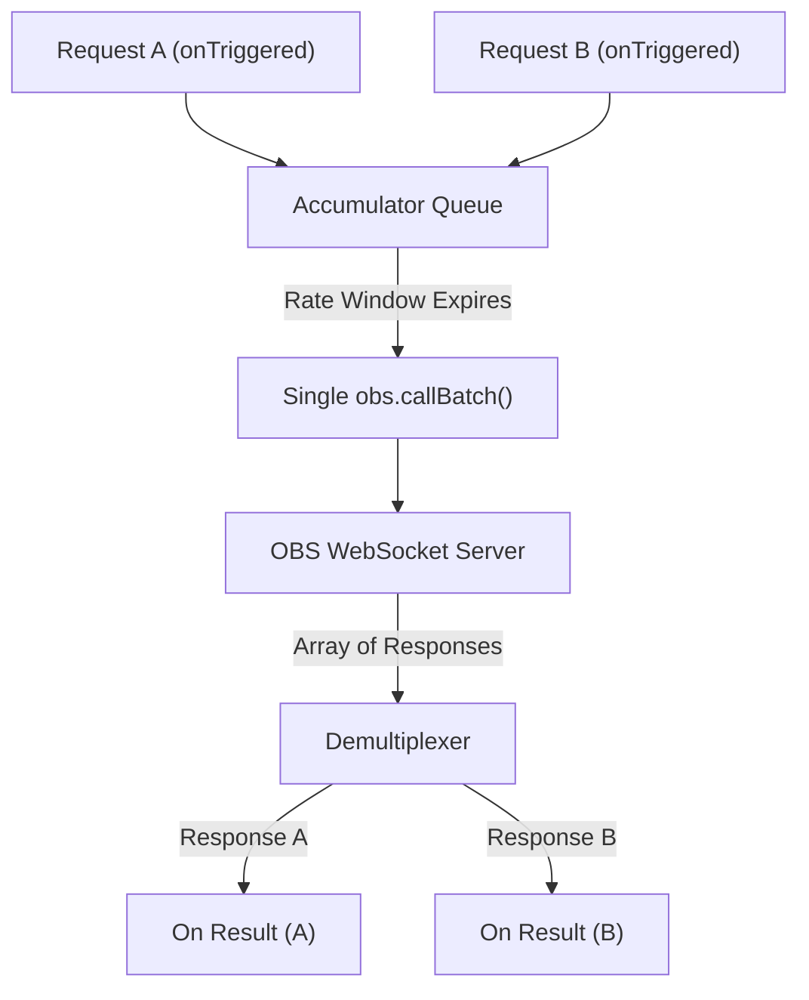

# Implementation Plan - OBS Request Rate & Bundling in ObsRequest

This plan details the implementation of a **Request Rate (Hz) and message bundling** feature inside the standard `ObsRequest` operator, making the `ObsBatchRequest` operator completely redundant.

---

## Proposed Architecture

To prevent rate-limit overload on the OBS WebSocket connection, we will introduce a configurable **Request Rate (Hz)** input port to `ObsRequest`. 

If multiple requests (from single actions or batches) are triggered during a rate window:
1. They are accumulated in a transaction queue.
2. Once the rate window expires, they are compiled into a **single bundled batch request** using OBS standard `callBatch()`.
3. When the batch response is received, the operator automatically demultiplexes the results and resolves each original request independently, firing the output trigger sequentially for each completed transaction.

---

## Performance & Architectural Implications

### 1. Network Overhead (Highly Optimized)
* **Without Bundling:** Sending $N$ requests in rapid succession generates $N$ separate WebSocket frame transmissions. Each frame incurs network serialization, TCP header wrapping, and TLS encryption overhead.
* **With Bundling:** Compresses $N$ requests into a **single WebSocket packet**. This massively reduces packet count, socket traffic, and minimizes network interface usage.

### 2. Latency Profiles
* **Immediate Mode (Rate = 0):** **No latency changes.** The operator bypasses the queue entirely and fires immediately, preserving raw execution speed with zero performance degradation.
* **Throttled Mode (Rate > 0):** Intentionally introduces a small queue latency of up to `1000/Rate` ms (e.g., maximum 100ms at 10 Hz) to allow incoming requests to group together.

### 3. OBS Server Resource Load
* OBS WebSocket server handles a single batched array substantially faster and more efficiently than handling numerous concurrent single-frame connections. 
* Batch execution inside OBS is processed in a single thread tick, which prevents race conditions or source-locking issues when setting multiple inputs simultaneously.

### 4. Memory and CPU Utilization
* **JS Memory Overhead:** Negligible. The array accumulation and index mapping process takes less than **0.05 milliseconds** of JS runtime, consuming less than a few kilobytes of transient heap memory.

---

## Proposed Changes

### 1. [MODIFY] [ObsRequest.js](file:///Users/jonwood/Github_local_dev/cablesStudio/ops/Ops.Extension.Standalone.Obs/Ops.Local.ObsRequest/Ops.Local.ObsRequest.js)

* **New Input Port:** `inRate = op.inFloat("Request Rate (Hz)", 0)`
  * Default is `0` (disabled / immediate execution).
  * If greater than `0`, requests are throttled and accumulated.
* **Accumulator Queue:** Track `pendingTransactions` (representing individual trigger invocations containing their payload, request ID, and request type).
* **Booking Mapping:** Use index bookkeeping to match OBS `callBatch` array responses back to the correct original single or batched transaction.

### 2. [DELETE] [ObsBatchRequest.js](file:///Users/jonwood/Github_local_dev/cablesStudio/ops/Ops.Extension.Standalone.Obs/Ops.Local.ObsBatchRequest/Ops.Local.ObsBatchRequest.js)

* Completely delete the redundant `ObsBatchRequest.js` file and its operator folder since its dynamic batching and rate-limiting functionality is now natively and transparently handled by `ObsRequest.js`.

---

## Verification Plan

### Automated / Manual Tests
1. **Disabled Rate-Limiting (Rate = 0):** Verify that standard single/batch OBS requests execute immediately with zero latency.
2. **Throttled Execution (Rate = 5 Hz / 200ms):** 
   * Trigger 5 requests simultaneously.
   * Verify they are bundled into a single batch call to OBS.
   * Verify that the client receives 5 separate response events corresponding to their original request IDs.
