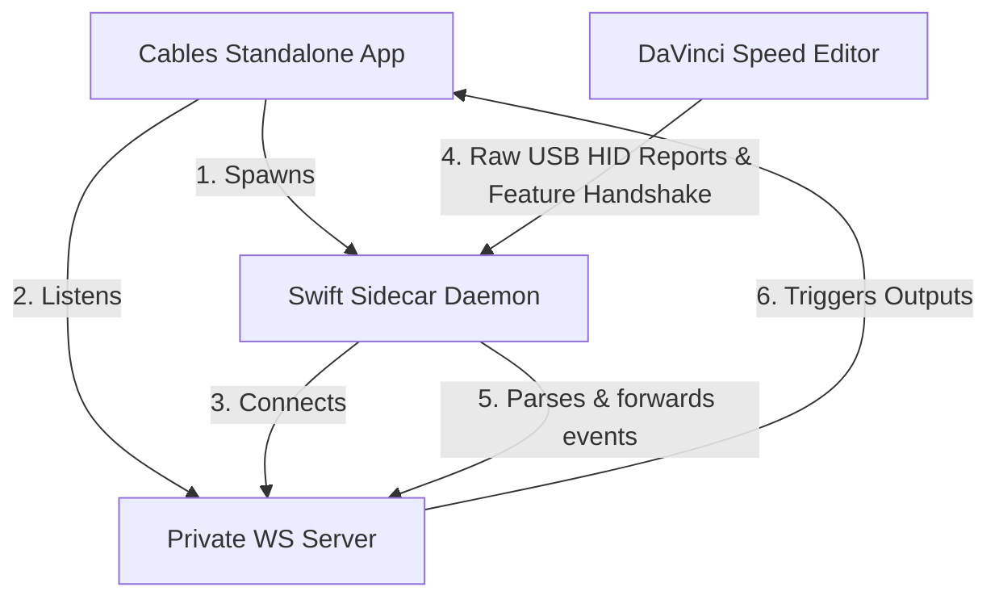

# Ops.Extension.Standalone.Swift.SwiftBmdSpeedEditor

A native standalone Cables operator for macOS (Electron environment) that interfaces with the **Blackmagic Design DaVinci Resolve Speed Editor** controller.

It uses a compiled Swift sidecar daemon utilizing macOS's native `IOKit/IOHIDManager` framework to perform the challenge-response authentication handshake, unlock the device, and stream events (keys, jog wheel, and battery status) via a private loopback WebSocket server.

---

## Technical Architecture



By communicating directly with Apple's `IOKit` framework, the operator **requires no external dependencies or drivers** (such as Homebrew, `libusb`, or `pip` modules).

---

## Installation & Setup

### Step 1: Close Conflicting Software
*   **You must Quit/Close DaVinci Resolve** before running this operator, as it claims exclusive control over the device and its handshake.

### Step 2: Build the sidecar binary
Because the sidecar executable runs natively, it must be compiled locally to avoid security issues:

1. Open **Terminal** and navigate to this operator's directory:
   ```bash
   cd ops/Ops.Extension.Standalone.Swift.SwiftBmdSpeedEditor/
   ```
2. Build the Swift project:
   ```bash
   swift build -c release
   ```
3. Copy the compiled executable to the destination directory:
   ```bash
   mkdir -p swift_bin
   cp .build/release/SwiftBmdSpeedEditor swift_bin/
   ```
4. **Ad-hoc sign the binary** (required on Apple Silicon macOS to prevent the OS from terminating it with a `SIGKILL`):
   ```bash
   codesign --force --sign - swift_bin/SwiftBmdSpeedEditor
   ```

---

## Operator Ports

### Inputs
*   **`Active`** (boolean): Set to `true` to establish the WebSocket channel, spawn the sidecar process, and start monitoring. Set to `false` to cleanly terminate the background daemon.
*   **`LEDs State`** (object): An easy way to control key LEDs by setting key names (e.g., `"CUT"`, `"CLOSE_UP"`, `"CAM1"`, `"JOG"`, etc.) to `0` or `1` / `true` or `false`.
*   **`Button LEDs`** (integer): A 32-bit bitfield controlling standard key LEDs (e.g. CUT, SMOOTH_CUT, CAM1-9, etc).
*   **`Jog LEDs`** (integer): A 3-bit bitfield controlling JOG, SHTL, and SCRL LEDs on the search dial.
*   **`Jog Mode`** (integer): Selects the jog wheel reporting mode (Relative or Absolute).

### Outputs
*   **`On Event`** (trigger): Fires whenever any button is pressed/released, or the jog wheel is turned.
*   **`Status`** (string): Tells you the current daemon connection state (e.g., `Stopped`, `Listening...`, `Connected`, `Binary Not Found`).
*   **`Running`** (boolean): `true` if the Swift background process is active.
*   **`Keys Pressed`** (array): List of numerical keycodes currently held down.
*   **`Key Names`** (array): List of friendly key names currently held down.
*   **`Last Key`** (string): Friendly name of the last key state change.
*   **`Last Key Pressed`** (boolean): `true` if pressed, `false` if released.
*   **`Key Event`** (trigger): Fires when any key is pressed or released.
*   **`Jog Value`** (integer): The absolute position value of the jog wheel.
*   **`Jog Delta`** (integer): The relative movement value since the last frame.
*   **`Jog Turned`** (trigger): Fires when the jog wheel is turned.
*   **`Battery Level`** (integer): Internal battery charge level (0-100).
*   **`Charging`** (boolean): `true` if the unit is charging via USB.


---

## Jog Modes & Log Output

The search dial (jog wheel) supports multiple operational modes controlled via the **`Jog Mode`** input port:

### 1. Jog Modes

| Mode Value | Name | Description | `Jog Delta` Behavior |
| :--- | :--- | :--- | :--- |
| **`0`** | `RELATIVE_0` | Default relative mode. | Reports relative motion ticks directly (positive for clockwise, negative for counter-clockwise). |
| **`1`** | `ABSOLUTE_CONTINUOUS` | Cumulative tracking mode. | Reports absolute position (`-4096` to `4096`). Delta is computed as `current - previous`. |
| **`2`** | `RELATIVE_2` | Alternate relative mode. | Same as mode 0. Reports relative motion ticks directly. |
| **`3`** | `ABSOLUTE_DEADZERO` | Cumulative mode with dead band. | Reports absolute position with a small dead band around zero mapping to `0`. Delta is computed as `current - previous`. |

### 2. Key LED Control (Object)

You can set key LEDs using a JSON object passed to the **`LEDs State`** input port. The key of the object is the friendly name, and the value is `1` / `true` (on) or `0` / `false` (off).

Example:
```json
{
  "CUT": 1,
  "CLOSE_UP": true,
  "CAM1": 1,
  "JOG": 1
}
```

Available Key Names for LEDs:
* Standard keys: `"CLOSE_UP"`, `"CUT"`, `"DIS"`, `"SMOOTH_CUT"`, `"TRANS"`, `"SNAP"`, `"LIVE_OVERWRITE"`, `"CAM1"` to `"CAM9"`, `"VIDEO_ONLY"`, `"AUDIO_ONLY"`.
* Search dial mode keys: `"JOG"`, `"SHTL"`, `"SCRL"`.

### 3. Log Output Interpretation

The Swift sidecar daemon outputs status information to `stdout`, which is forwarded automatically to the Cables log console (prefixed by `[SwiftBmdSpeedEditor Output]`):

* **`🔌 Connecting to local Cables Standalone WebSocket server...`**: The sidecar has launched and is trying to connect to the Cables editor server port.
* **`🔌 Native IOHIDManager opened and monitoring for Speed Editor...`**: macOS's IOHIDManager was successfully initialized.
* **`🔌 DaVinci Speed Editor connected. Authenticating...`**: The Speed Editor hardware was detected on a USB port, and the cryptographic handshake is starting.
* **`🔄 Performing periodic re-authentication...`**: Occurs every 500 seconds to keep the device unlocked (the hardware locks itself after 600 seconds of inactivity).
* **`❌ Failed to open IOHIDManager / authentication failed`**: The device is either unplugged or claimed by another app (e.g. DaVinci Resolve is open).

---

## Troubleshooting & Permissions

*   **Code Signature Invalid (`SIGKILL`):** If the sidecar terminates instantly with no logs and code `null`, macOS has blocked the unsigned binary. Ensure you run the `codesign` command described in **Step 2**.
*   **Input Monitoring Permissions:** Depending on your macOS security settings, you may need to grant Input Monitoring permissions to the **Cables** app in *System Settings > Privacy & Security > Input Monitoring*.
