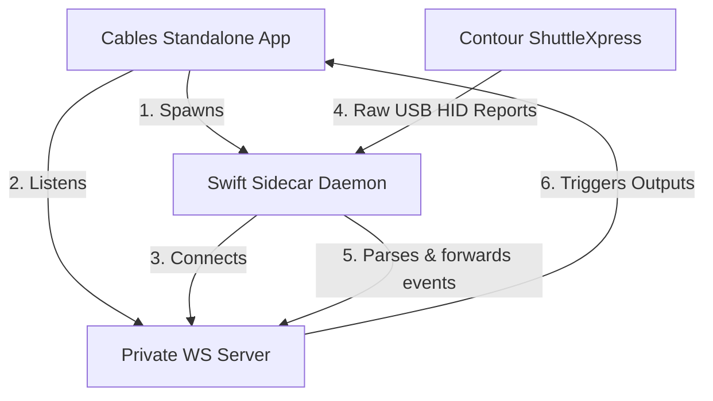

# Ops.Extension.Standalone.Swift.SwiftContourShuttleXpress

A native standalone Cables operator for macOS (Electron environment) that interfaces with the **Contour ShuttleXpress** controller.

It uses a compiled Swift sidecar daemon utilizing macOS's native `IOKit/IOHIDManager` framework to stream device events (dials and buttons) via a private loopback WebSocket server.

---

## Technical Architecture



By communicating directly with Apple's `IOKit` framework, the operator **requires no external dependencies or drivers** (such as Homebrew, `libusb`, or `pip` modules).

---

## Installation & Setup

### Step 1: Close Conflicting Drivers
The official Contour Design companion software locks the HID interface exclusively.
* **You must Quit/Close the official Contour companion software** before activating this operator.

### Step 2: Build the sidecar binary
Because the sidecar executable runs natively, it must be compiled locally to avoid security issues:

1. Open **Terminal** and navigate to this operator's directory:
   ```bash
   cd ops/Ops.Extension.Standalone.Swift.SwiftContourShuttleXpress/
   ```
2. Build the Swift project:
   ```bash
   swift build -c release
   ```
3. Copy the compiled executable to the destination directory:
   ```bash
   mkdir -p swift_bin
   cp .build/release/SwiftContourShuttleXpress swift_bin/
   ```
4. **Ad-hoc sign the binary** (required on Apple Silicon macOS to prevent the OS from terminating it with a `SIGKILL`):
   ```bash
   codesign --force --sign - swift_bin/SwiftContourShuttleXpress
   ```

---

## Operator Ports

### Inputs
* **`Active`** (boolean): Set to `true` to establish the WebSocket channel, spawn the sidecar process, and start monitoring. Set to `false` to cleanly terminate the background daemon.

### Outputs
* **`On Event`** (trigger): Fires whenever any button is pressed/released or a dial is moved.
* **`Status`** (string): Tells you the current daemon connection state (e.g., `Stopped`, `Listening...`, `Connected`, `Binary Not Found`).
* **`Running`** (boolean): `true` if the Swift background process is active.
* **`Jog Value`** (integer): The absolute rotation counter of the jog dial (0–255).
* **`Jog Delta`** (integer): The relative turn amount of the jog wheel (typically `-1` or `1`).
* **`Jog Turned`** (trigger): Fires when the jog wheel turns.
* **`Shuttle Value`** (integer): The current deflection index of the outer spring-loaded shuttle ring (`-7` to `+7`).
* **`Shuttle Moved`** (trigger): Fires when the shuttle ring is turned.
* **`Button Index`** (integer): The index of the button involved in the last event (`0` to `4`, matching left-to-right layout).
* **`Button Pressed`** (boolean): `true` if pressed, `false` if released.
* **`Button Event`** (trigger): Fires when any button is pressed or released.

---

## Raw USB Event Sniffer

If buttons are not mapping as expected (for instance, on varying firmware revisions or alternate models), you can bypass the Cables app and sniff the raw USB reports directly from the Terminal.

### How to use `sniffer.swift`:
1. Open Terminal and navigate to the directory:
   ```bash
   cd ops/Ops.Extension.Standalone.Swift.SwiftContourShuttleXpress/
   ```
2. Run the script directly:
   ```bash
   swift sniffer.swift
   ```
3. Press buttons or turn dials on your device. The raw 5-byte HID reports will print to the console:
   ```text
   📥 Raw HID Report (length 5): [00 (0), F4 (244), 00 (0), 10 (16), 00 (0)]
   ```

---

## Troubleshooting & Permissions

* **Code Signature Invalid (`SIGKILL`):** If the sidecar terminates instantly with no logs and code `null`, macOS has blocked the unsigned binary. Ensure you run the `codesign` command described in **Step 2**.
* **Input Monitoring Permissions:** Depending on your macOS security settings, you may need to grant Input Monitoring permissions to the **Cables** app in *System Settings > Privacy & Security > Input Monitoring*.
