# Elgato Stream Deck Standalone Swift Operators

A collection of high-performance Cables GL operators designed for the standalone (Electron) environment on macOS to interface natively with Elgato Stream Decks using a compiled Swift sidecar binary communicating via WebSockets.

This is a direct, high-efficiency replacement for the Python-based Stream Deck operators.

---

## Key Advantages (Swift vs. Python)

- **Zero Runtime Dependencies**: No need to install Python, `pip`, or any python modules like `Pillow`, `streamdeck`, or `hidapi`.
- **Lower Latency & CPU Overhead**: Native CoreGraphics/ImageIO resizing and memory-mapped slicing in Swift are highly optimized and run off the main NodeJS/Electron UI thread.
- **Embedded HID APIs**: Built directly on macOS `IOKit.hid` and `IOHIDManager` without any external wrapper translation layers.
- **Robust Image Processing**: Direct support for Stream Deck v1/Mini (native BGR byte streams) and Stream Deck XL (chunked JPEGs) built natively in the binary.

---

## Included Operators

1. **`SwiftStreamDeck`**: Manages the connection lifecycle of the background compiled Swift sidecar process. Listens to button presses/releases, and exposes a shared `Connection` object.
2. **`SwiftStreamDeckKeyTexture`**: Renders and maps a Cables WebGL texture to a single specific key on the Stream Deck.
3. **`SwiftStreamDeckStretchedTexture`**: Renders and tiles a single Cables WebGL texture across the entire physical screen grid of the Stream Deck.

---

## System Requirements & Setup

These operators communicate directly with the USB HID interface of your Stream Deck, bypassing the official Elgato software.

### Step 1: Close Conflicting Software
The official Elgato Stream Deck desktop application locks the USB HID interface exclusively.
- **You must close/quit the official Stream Deck software** before starting the Cables connection. Check your system tray or menu bar to ensure it has fully exited.

### Step 2: Build the Sidecar Binary
The project is set up as a standard Swift Package Manager (SPM) executable target. It compiles down to a single binary with zero external library linking required.

To compile the binary:
1. Open terminal and navigate to the main operator folder:
   ```bash
   cd ops/Ops.Extension.Standalone.Swift.SwiftStreamDeck
   ```
2. Build the project in release mode:
   ```bash
   swift build -c release
   ```
3. Copy the compiled binary to the `swift_bin` directory:
   ```bash
   mkdir -p swift_bin
   cp .build/release/SwiftStreamDeck swift_bin/SwiftStreamDeck
   ```

*(Note: The JS wrapper is pre-configured to look for the binary at `swift_bin/SwiftStreamDeck` and automatically sets execute permissions when launched.)*

---

## How to Configure in Cables

1. Place the **`Ops.Extension.Standalone.Swift.SwiftStreamDeck`** operator in your patch.
2. Toggle **`Active`** to `true`.
   - The Javascript operator starts a private WebSocket Server on a dynamic loopback port (`127.0.0.1:0`).
   - It spawns the `SwiftStreamDeck` sidecar binary and passes the dynamic port parameter.
   - The Swift binary connects as a client and begins monitoring Stream Decks.
   - Once connected, the status port updates to `Connected to [Device Name]` (e.g. `Connected to Stream Deck XL`).
3. Connect the `Connection` output port of `SwiftStreamDeck` to the `Connection` input port of either `SwiftStreamDeckKeyTexture` or `SwiftStreamDeckStretchedTexture`.
4. Attach a trigger to `Render` (to run every frame) and feed your WebGL `Texture` to display it on the keys!

---

## Architectural Deep Dive

```mermaid
sequenceDiagram
    participant Cables as Cables GL (Electron)
    participant Server as Node WebSocket Server (Dynamic Port)
    participant Sidecar as Swift Sidecar Client (SwiftStreamDeck)
    participant USB as Stream Deck Device (USB HID)

    Cables->>Server: Start Server on Port 0
    Server->>Sidecar: Spawn process with --port <port>
    Sidecar->>Server: Establish WebSocket Connection
    Server->>Sidecar: send {"action": "connect", "device_index": 0}
    Sidecar->>USB: Claim USB HID Device Ownership
    Sidecar->>Server: send {"type": "connected", "model": "...", ...}
    Server->>Cables: Update Status & Expose Connection

    rect rgb(20, 20, 30)
        Note over Cables, Sidecar: Texture Frame Update Loop
        Cables->>Server: Capture WebGL FBO Canvas to JPEG base64
        Server->>Sidecar: send {"action": "set_key_image", "key": X, "image": "..."}
        Sidecar->>Sidecar: Decode JPEG & Resize via CoreGraphics
        Sidecar->>USB: Send raw reports/packets over USB HID
    end

    rect rgb(30, 20, 20)
        Note over USB, Cables: Button Interaction Event Loop
        USB->>Sidecar: Button Pressed Callback (IOHIDReport)
        Sidecar->>Server: send {"type": "key_event", "key": Y, "pressed": true}
        Server->>Cables: Trigger "Key Event" & Set Index/Pressed ports
    end
```



### Image Format & Chunking Specs:
- **Original Stream Deck (v1) & Stream Deck Mini**: These models require raw BGR byte arrays to update display keys.
  - The sidecar decodes the base64 JPEGs to raw CGImage contexts, strips the alpha channel, and flips the byte order to BGR.
  - The image bytes are packetized into multiple HID reports (Page 1 header + Page 2 header chunk loop) defined by model page limits.
- **Stream Deck XL**: This model accepts chunked JPEG images directly.
  - The sidecar takes the decoded image data, compresses it to lossy JPEG bytes natively using `CIContext.jpegRepresentation`, and transmits them chunked in 1024-byte payloads.

### JSON Wire Protocol Spec:
Messages sent from **Cables to Sidecar**:
- `{"action": "connect", "device_index": 0}`: Connects to a specific index of connected devices.
- `{"action": "set_key_image", "key": 0, "image": "<base64>"}`: Sets the display image of a single logical key (0-indexed).
- `{"action": "set_stretched_image", "image": "<base64>"}`: Sets an overall image stretched across the key layout.
- `{"action": "close"}`: Gracefully resets the keys, releases the USB interface, and terminates the sidecar.

Messages sent from **Sidecar to Cables**:
- `{"type": "connected", "model": "Stream Deck XL", "keys": 32, "rows": 4, "cols": 8, "key_width": 96, "key_height": 96}`: Emitted upon successful initialization.
- `{"type": "key_event", "key": 0, "pressed": true}`: Emitted when a key state transitions.
- `{"type": "disconnected"}`: Emitted when a device is unplugged.
- `{"type": "error", "message": "..."}`: Emitted upon driver or protocol errors.

---

## Troubleshooting & Common Questions

### ⚠️ Error: `Failed to open Stream Deck: ...` or `No Stream Decks connected.`
*   **Cause**: Either the official Elgato companion application is still running and holds an exclusive lock on the USB interface, or your user account lacks permissions to write to USB HID.
*   **Resolution**: 
    1. Fully close/exit the Elgato Stream Deck app.
    2. Try connecting the Stream Deck to a different USB port directly (avoid unpowered or daisy-chained hubs).

### ⚠️ My images look upside down / mirrored?
*   The Javascript operators automatically handle the WebGL coordinate flip (`ctxTarget.scale(1, -1)`) prior to base64 export to compensate for WebGL's bottom-left origin. Ensure your texture inputs are fed from active rendering loops.

### ⚠️ Compile Error: `static property verboseMode is not concurrency-safe...`
*   Our embedded version of `Codedeck` has been adjusted for the strict concurrency features of Swift 6. Ensure you are using the embedded files under `source/` instead of fetching vanilla versions from the master branch.
