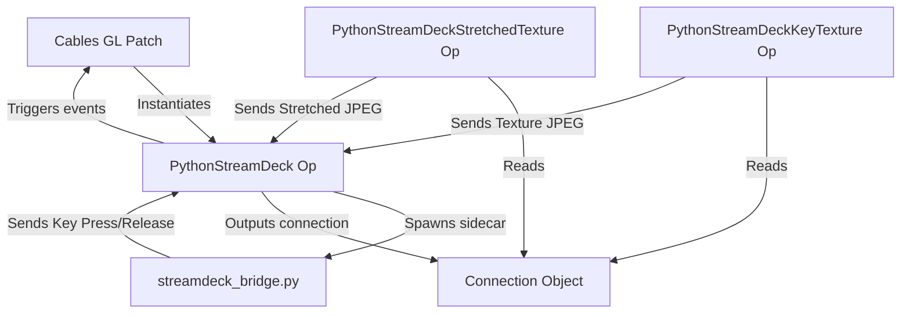

# Implementation Plan - Elgato Stream Deck Standalone Operators

This plan outlines the design and implementation of three new Cables GL operators designed for the standalone (Electron) environment to interface with Elgato Stream Decks.

## Overview

The Stream Deck integration will utilize a Python-based background sidecar process communicating with Cables via standard input/output (`stdin`/`stdout`) JSON streams. This architecture is chosen to match existing hardware integrations (like UVC PTZ camera control and keyboard/mouse monitors) in the codebase. By running USB communication and image encoding/slicing in a separate Python process, we prevent the Electron WebGL renderer thread from stuttering.

To update button displays efficiently, Cables will read WebGL texture pixels, draw them onto an offscreen canvas, export them to a compressed JPEG Base64 string, and pipe them to Python. The Python process will then decode, crop/scale, and write them to the Stream Deck keys via the `python-elgato-streamdeck` library.

---

## User Review Required

> [!IMPORTANT]
> **External System Dependencies**
> To use these operators, the local machine must have:
> 1. Python 3 installed.
> 2. The `streamdeck` and `Pillow` packages installed: `pip install streamdeck Pillow`.
> 3. For macOS and Linux, the `libusb` library is required (e.g., `brew install libusb`).
> 4. The official Elgato Stream Deck application must be closed/disabled, as it locks the USB HID interface exclusively.

---

## Python Configuration Integration

The operators will retrieve the configured Python executable path from the global patch property `op.patch.pythonStandaloneExecutable` (which is managed and verified by the standard `Ops.Extension.Standalone.PythonConfig` operator). If not set, it will default to `"python3"`.

---

## Open Questions

> [!NOTE]
> *None (Feedback resolved: Expose JPEG Quality setting).*

---

## Proposed Changes

### Standalone Operators

We will place the operators directly under the local Python ops directory: [ops/Ops.Local.Python/](file:///Users/jonwood/Github_local_dev/cablesStudio/ops/Ops.Local.Python/).

#### [NEW] [streamdeck_bridge.py](file:///Users/jonwood/Github_local_dev/cablesStudio/ops/Ops.Local.Python/Ops.Extension.Standalone.PythonStreamDeck/python_script/streamdeck_bridge.py)

A python script that manages connection to the physical Stream Deck:
- Initializes the device and checks for required libraries (`StreamDeck` and `PIL`). Emits error events if missing.
- Listens on `stdin` for JSON messages:
  - `connect`: Opens a device by index. Emits `connected` event with layout information `(columns, rows)`.
  - `set_key_image`: Takes a key index and a base64 JPEG, decodes it, converts to the deck's native format, and writes it.
  - `set_stretched_image`: Takes a base64 JPEG, decodes it, resizes it to the grid aspect ratio (`columns * key_width` by `rows * key_height`), slices it into individual button crops, and writes to each button.
  - `close`: Resets device keys and exits.
- Registers a button callback and writes key down/up events to `stdout` (`{"type": "key_event", "key": int, "pressed": bool}`).

---

### Components & File Structure

#### [NEW] [Ops.Extension.Standalone.PythonStreamDeck](file:///Users/jonwood/Github_local_dev/cablesStudio/ops/Ops.Local.Python/Ops.Extension.Standalone.PythonStreamDeck)
Main controller op that manages the sidecar lifecycle.

- **Ports**:
  - `Active` (Bool, default: `false`): Controls whether the Python process is spawned.
  - `Device Index` (Int, default: `0`): Which Stream Deck to open.
  - `Connection` (Object, Out): Ref to connection class that exposes send methods.
  - `Is Connected` (Bool, Out)
  - `Status` (String, Out): Error or connection status logs.
  - `Device Info` (Object, Out): JSON representing device specifications.
  - `Key Event` (Trigger, Out): Fires when a key changes state.
  - `Event Key Index` (Number, Out): Index of the key.
  - `Event Pressed` (Bool, Out): True if down, False if up.

#### [NEW] [Ops.Extension.Standalone.PythonStreamDeckKeyTexture](file:///Users/jonwood/Github_local_dev/cablesStudio/ops/Ops.Local.Python/Ops.Extension.Standalone.PythonStreamDeckKeyTexture)
Binds a texture to a single Stream Deck key.

- **Ports**:
  - `Connection` (Object, In): Reference from `PythonStreamDeck`.
  - `Key Index` (Int, default: `0`)
  - `Texture` (Texture, In)
  - `Render` (Trigger, In): Frame trigger.
  - `Active` (Bool, default: `true`)
  - `JPEG Quality` (Float, default: `0.85`)

#### [NEW] [Ops.Extension.Standalone.PythonStreamDeckStretchedTexture](file:///Users/jonwood/Github_local_dev/cablesStudio/ops/Ops.Local.Python/Ops.Extension.Standalone.PythonStreamDeckStretchedTexture)
Bridges a single texture and stretches it across all buttons.

- **Ports**:
  - `Connection` (Object, In): Reference from `PythonStreamDeck`.
  - `Texture` (Texture, In)
  - `Render` (Trigger, In): Frame trigger.
  - `Active` (Bool, default: `true`)
  - `JPEG Quality` (Float, default: `0.85`)

---

## Verification Plan

### Automated/Unit Tests
- Verify that standard JSON command payloads can be correctly serialized/deserialized between Node.js and the Python script.
- Verify PIL-based slicing coordinates and key index mapping math in python.

### Manual Verification
1. Open the Cables standalone app.
2. Place the `PythonStreamDeck` op, and toggle `Active` to `true`. Verify the status shows successful connection and lists the device info.
3. Test key presses: Press keys on the Stream Deck and verify the key index and press states are correctly received and trigger output in Cables.
4. Place a texture creator op (e.g. `RenderToTexture` or a simple canvas op).
5. Pass the texture into `PythonStreamDeckKeyTexture` and map it to key index `0`. Check the button updates.
6. Pass the texture into `PythonStreamDeckStretchedTexture` and verify it tiles perfectly across all screens.
