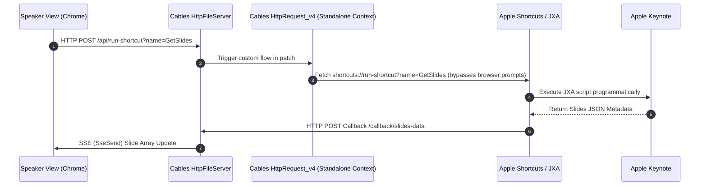

# Keynote Studio App

Keynote Studio App is a specialized presentation environment built on top of the **Keynote** Apple API. It coordinates slide selections and automates OBS program scene changes programmatically based on slide-to-scene mappings.

## Technologies Used

* **Apple Keynote** - macOS presentation software.
* **macOS JXA (JavaScript for Automation)** - Scripting language used to control Keynote programmatically.
* **Apple Shortcuts** - macOS automation utility acting as the trigger target for JXA scripts.
* **Cables GL Standalone** - Electron-based local runtime that serves static files and proxies HTTP endpoints.
* **Chrome** - Google's web browser used to display the presenter Speaker View UI.
* **OBS WebSocket (v5.x)** - Low-latency API for real-time OBS control and picture-in-picture screenshot capture.

---

## Data Flow & Architecture

Keynote Studio implements a visual hybrid communication strategy that completely decouples presentation layouts from operating system popups or third-party plugins.



### 1. On Load / Synchronization
1. The Chrome Speaker View UI makes a request to index Keynote slides by calling the Cables standalone proxy endpoint `/api/run-shortcut?name=getSlides`.
2. The Cables standalone app triggers the native visual `Ops.Json.HttpRequest_v4` operator to call the macOS custom URI protocol `shortcuts://run-shortcut?name=getSlides`.
3. Bypassing browser prompts, the Apple Shortcut executes the JXA script (`getSlides.js`) inside macOS.
4. The JXA script queries the active Keynote document, compiles the slide names, sections, mapped scenes, and notes, and POSTs the structured JSON payload back to `/callback/slides-data`.
5. Cables forwards the JSON payload using Server-Sent Events (SSE) via the `/api/sse` connection back to Chrome, updating the slide table.

### 2. Relative Navigation
1. The presenter presses arrow keys, Spacebar, or PageDown in Chrome Speaker View.
2. Chrome intercepts the key event, triggers OBS WebSocket transitions if the upcoming slide has a scene mapping, and calls the JXA navigation proxy `/api/run-shortcut?name=navigate&input=next` (or `previous`).
3. The JXA script calculates the active index, automatically skips any skipped slides in Keynote, and moves the active selection.
4. UI triggers a synchronizing update to fetch the latest index and details.

### 3. Saving Scene Mappings
1. In the UI, the presenter selects a slide row, inputs an OBS scene name, and clicks **Save Slide Scene**.
2. The UI sends a request to `/api/run-shortcut?name=setSlideScene` with a serialized JSON input parameter containing the `slideNumber`, `sceneName`, and the client-generated slide `uuid`.
3. JXA stops the presentation slideshow to release the document lock, splits notes by the `|||` delimiter, updates/creates the metadata block while retaining preexisting slide IDs, re-serializes, saves the presenter notes back to Keynote, and navigates editor focus to the modified slide.

---

## Setup

### Cables Setup
1. Launch Cables GL Standalone.
2. Open the Cables GL Standalone project containing the Keynote Studio backend patch.
3. Click the **Run** button to start the server (default port `57000`).

### Keynote Setup
1. Open a presentation in Apple Keynote.
2. Start the presentation in Window mode (or Fullscreen mode).

### OBS Setup
1. Launch OBS and enable OBS WebSocket server under **Tools -> WebSocket Server Settings** (port `4455`).
2. Capture the Keynote presentation window as a Window Capture source (typically named `Keynote Presentation`).
3. Capture the Keynote presenter view as a Window Capture source (typically named `Keynote Presenter Notes`).

### Chrome Setup
1. Open Google Chrome and navigate to `http://localhost:57000/slides_studio/keynote-studio-app/index.html`.
2. Go to **OBS Settings** layout, input your OBS port/password, and click **Connect**.
3. Apply your preferred downscaled screenshot width (e.g. `256px`) and polling interval (e.g. `0.5s`) to initialize visual picture-in-picture monitoring.

---

## User Interface Layouts

Keynote Studio features a switchable responsive UI:
1. **Studio Layout**: A data-driven presenter cockpit. Includes split screen picture-in-picture window feeds of current/next slides, a slide index table (Tabulator), and a scene mapping configuration sidebar.
2. **Teleprompter Layout**: A large-font teleprompter designed for speech tracking. Features a 60fps auto-scrolling engine utilizing `requestAnimationFrame`, customizable font scaling, and automatic reset/scroll triggering as slides change.
3. **OBS Settings**: Custom connection configurations, OBS source name bindings, downscaled screenshot pixel widths, and interval sliders.

---

## Keynote Notes Structure

To enable fully database-free persistence, slide metadata is stored directly inside the slide's Keynote presenter notes. A unique delimiter **`|||`** separates the structured metadata block from the spoken presentation notes:

```
[JSON Metadata Block]
|||
[Clean Speaker Notes / Presentation Text]
```

### Metadata JSON Schema
```json
{
  "Name": "Slide Title",
  "Scene": "OBS Program Scene Name",
  "Section": "Presentation Section Name",
  "Id": "a1b2c3d4-e5f6-7a8b-9c0d-e1f2a3b4c5d6"
}
```

---

## Interface Schemas

This section documents the exact JSON payload schemas flowing across Keynote Studio interfaces.

### 1. `/callback/slides-data` POST Payload Schema
This JSON structure is generated by [getSlides.js](file:///Users/jonwood/Github_local_dev/cablesStudio/slides_studio/keynote-studio-app/shortcuts/getSlides.js) and POSTed to the Cables proxy server on Keynote deck sync requests:

```json
{
  "ActiveIndex": 2,
  "Slides": [
    {
      "Index": 1,
      "Name": "Introduction",
      "Scene": "Title Screen",
      "Section": "Intro",
      "Id": "9d90ef0d-cb9e-4e4b-b0b3-1fcfb79440bd",
      "Notes": "Welcome to our presentation. Today we will discuss Keynote Studio."
    },
    {
      "Index": 2,
      "Name": "System Architecture",
      "Scene": "Over The Shoulder",
      "Section": "Tech",
      "Id": "e30c4516-e41c-4b68-bce6-6ce22cb612db",
      "Notes": "This diagram illustrates the visual triggering scheme and SSE flow."
    }
  ]
}
```

### 2. `setSlideScene` Input Parameter Schema
This JSON payload is serialized and passed as the `input` argument to the [setSlideScene.js](file:///Users/jonwood/Github_local_dev/cablesStudio/slides_studio/keynote-studio-app/shortcuts/setSlideScene.js) JXA script when updating mappings from the Chrome Speaker View:

```json
{
  "slideNumber": 2,
  "sceneName": "Over The Shoulder",
  "uuid": "e30c4516-e41c-4b68-bce6-6ce22cb612db"
}
```

### 3. `/api/run-shortcut` Proxy Request Schema
Endpoint triggered by Chrome to communicate with the background Cables stand-alone server:

* **Method**: `POST`
* **URL**: `/api/run-shortcut`
* **Query Parameters**:
  * `name`: Name of the target shortcut (`getSlides`, `goToSlide`, `navigate`, `setSlideScene`).
  * `input`: Input value to pass (e.g. navigation direction, target slide index, or serialized metadata JSON).

#### Example Requests:
* `/api/run-shortcut?name=navigate&input=next`
* `/api/run-shortcut?name=goToSlide&input=3`
* `/api/run-shortcut?name=setSlideScene&input=%7B%22slideNumber%22%3A2%2C%22sceneName%22%3A%22Over%20The%20Shoulder%22%2C%22uuid%22%3A%22uuid-here%22%7D`
